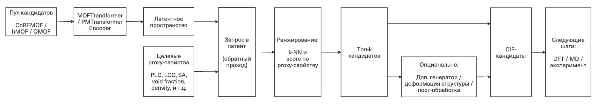

# Гибридный подход к обратному дизайну металло-органических каркасов (MOF) через латентное пространство MOF/PMTransformer и proxy-свойства.

## Летняя школа AIRI-2026

### Автор - Животенко Николай

### Аннотация

> Поиск новых металлоорганических каркасов (MOF) обычно идёт по пути прямой задачи "от структуры - к свойству". Для материаловедения гораздо полезнее обратная задача: "от свойства - к структуре", известная как обратный дизайн (inverse design). Foundation-модель MOFTransformer/PMTransformer [1] решает только прямую задачу. Deep dreaming на chemical language model [2] решает обратную, но работает только с текстовым представлением линкера MOF и теряет геометрию каркаса. Я предлагаю взять латентное пространство MOFTransformer/PMTransformer как промежуточный слой между желаемыми свойствами и CIF-кандидатами и свести задачу обратного дизайна к поиску в этом латентном пространстве.

---

## Введение

Металлоорганические каркасы (MOF, metal-organic frameworks) изменили подход к созданию функциональных материалов [3]. Их применяют в фотокатализе, полупроводниках, накоплении энергии, разделении газов и многом другом. Главная их особенность - модульность: структура собирается из неорганических узлов и органических линкеров, объединённых в топологическую сеть, и каждый блок можно менять. Поэтому MOF часто называют "дизайнерскими" материалами. Сегодня уже синтезировано более 100 тысяч MOF, а число гипотетически возможных комбинаций фактически безгранично. На практике для поиска подходящего MOF под конкретную задачу обычно применяют высокопроизводительный вычислительный скрининг (HTCS, high-throughput computational screening), всё чаще усиленный методами машинного обучения (ML). Схема простая: берут большую базу уже известных структур, считают для каждого MOF целевой KPI (key performance indicator) и выбирают лучшие. Главная слабость такого подхода - смещение распределения известных материалов в сторону тех функциональностей, для которых они изначально создавались, а не тех, которые нужны. Из-за этого ограничения активно развивается обратный дизайн: задан целевой KPI - сгенерировать один или несколько MOF in silico, которые ему соответствуют.

## 1. Анализ

Две выбранные мной статьи показывают два полюса того, как сегодня подходят к задаче проектирования MOF.

**MOFTransformer / PMTransformer [1]** - мощная foundation-модель, которая использует сразу два представления: атомный граф и энергетическую сетку, которые получают из кристаллографических информационных файлов (CIF). Модель предобучена на примерно 1,9 млн. гипотетических пористых материалов, поэтому хорошо переносится на разные свойства через fine-tuning. Но она решает только прямую задачу "структура (CIF) >> свойство".

**Deep Dreaming MOF [2]** - другой полюс. Здесь MOF представлен в текстовом представлении: органические линкеры через дифференцируемые текстовые SELFIES-токены[5] (аналог SMILES) с one-hot encoding, неорганические узлы как не-дифференцируемые SELFIES-токены, а топология как текстовый токен с описанием структуры ретикулярной химии (RCSR). Исходя из этого chemical language model оптимизирует это текстовое представление, чтобы сместить свойства линкера к целевым. Это уже обратный дизайн, но он касается только линкера: металлический узел и топология фиксированы, а сама геометрия каркаса в явном виде не учитывается.

### Сравнение подходов

| Статья | Постановка | Представление MOF | Архитектура | Что решает / не решает |
| --- | --- | --- | --- | --- |
| MOFTransformer / PMTransformer | прямая: "CIF >> свойство" | atom-based graph и energy-grid | мульти-модальный transformer-encoder, pre-training на ~2 млн. структур [4] | SOTA-прогноз и transfer learning; **не** решает обратную задачу |
| Deep Dreaming MOF | обратная: "свойство >> SELFIES-токен линкера" | строковое (SELFIES / Group SELFIES) [5] | chemical language model + attention + gradient-based dreaming | оптимизирует линкер под цель; **не** учитывает геометрию каркаса и топологию |

### Сильные и слабые стороны

| Подход | Сильные стороны | Слабые стороны |
| --- | --- | --- |
| MOFTransformer / PMTransformer | мульти-модальность (графовое + энергетическое представление); большой pre-training датасет; универсальная fine-tuning схема под любое свойство; интерпретируемость через attention | работает только на прогноз; нет обратного контура; декодирование "латентное пространство >> CIF" не определено |
| Deep Dreaming MOF | end-to-end обратная оптимизация; интерпретируемость через attention; химическая валидность за счёт применения SELFIES-описания | оптимизируется только линкер; описывает узкий класс свойств; качество ограничено chemical language model |

## 2. Предложение

Предлагаемая мной идея простая: между "прямой" и "обратной" моделью есть полезный промежуточный латентный слой - латент. У MOF/PMTransformer он уже есть, потому что модель обучена связывать CIF со свойствами. Если этот латент действительно осмысленный, то близкие в нём структуры должны быть близки и по целевым свойствам. Тогда обратную задачу можно решать как поиск в латенте.

> **Гипотеза.** Латентное пространство MOF/PMTransformer кодирует структурно-функциональные регулярности MOF так, что близость в латенте систематически коррелирует с близостью по proxy-свойствам. Это позволяет свести обратный дизайн MOF к поиску (и при желании - к оптимизации) в латенте с последующим восстановлением CIF.

В чём отличие от исходных статей:

- от [1] - латент используется не как промежуточный признак, а как **поисковое пространство кандидатов**;
- от [2] - оптимизация ведётся не на тексте линкера, а в структурно ориентированном представлении (CIF + энергетическая сетка), то есть с сохранением геометрии каркаса.

Общая схема подхода представлена на Рис. 1.

Рис. 1. - Схема подхода к обратному дизайну MOF через латентное пространство MOF/PMTransformer

## 3. Эксперимент

### Цель

Проверить, согласован ли латент pretrained PMTransformer со структурными proxy-свойствами MOF и работает ли k-NN-поиск в этом латенте как поисковый слой для обратного дизайна.

### Данные

4500 структур (по 1500 из CoREMOF [6], hMOF [7] и QMOF [8]), seed = 42, опорная pretrained-модель PMTransformer [4] без fine-tuning. Proxy-дескрипторы: `n_atoms`, `n_metal_atoms`, `metal_fraction`, `formula_weight`, `cell_volume`, `density`.

### Пайплайн эксперимента

1. Сняты три варианта embeddings: `cls` (pooled CLS-токен), `raw_cls` (sequence representation до Pooler'а), `concat` (конкатенация graph- и grid-токенов).
2. Замеряна корреляция попарных евклидовых дистанций между "латент-proxy" (Spearman/Pearson на ~10 млн. пар) - это глобальный тест на согласованность геометрии латента с proxy-пространством.
3. Проведен поиск k-NN в латенте против двух baseline'ов: `proxy_kNN` (верхняя граница, ground truth по построению) и `random_kNN` (нижняя граница, случайные соседи при том же seed).

### Исходный код

Представлен в репозитории [https://github.com/niko-zvt/AIRI-2026-Proposal/Experiment/](https://github.com/niko-zvt/AIRI-2026-Proposal/Experiment/)

### Результаты

| Пространство | Spearman ρ (vs proxy) | Recall@5 | MAE@5 | Diversity@5 |
| --- | --- | --- | --- | --- |
| proxy-kNN (потолок) | - | 1.000 | 0.054 | 0.742 |
| random-kNN (пол) | - | 0.002 | 0.790 | 0.891 |
| латент `cls` | 0.508 | 0.050 | 0.406 | 0.368 |
| латент `raw_cls` | 0.495 | **0.055** | **0.375** | 0.423 |
| латент `concat` | 0.277 | 0.054 | 0.376 | 0.186 |

Значение коэффициента Спирмена около 0.5 говорит о том, что порядок расстояний между парами структур в латентном пространстве совпадает с порядком в proxy-пространстве примерно наполовину - то есть, если две структуры близки в латенте, они, как правило, близки и по структурным свойствам. Значение `Recall@5` для всех латентных вариантов выше, чем у случайного базового метода `random_kNN`; наилучший результат показывает вариант `raw_cls`. У варианта `concat` коэффициент Спирмена ниже из-за усреднения graph- и grid-токенов, но по метрикам поиска он почти не уступает `cls`. Показатель `Diversity@k` больше нуля для всех k - это значит, для любого числа ближайших соседей k среди них есть хоть какое-то разнообразие. Следовательно, признаков "mode collapse" нет.

| Recall@k | MAE@k |
| - | - |
|  |  |
| Рис. 2. Recall@k для трёх вариантов латента против `proxy_kNN` (потолок) и `random_kNN` (пол). Все три латента стабильно держатся выше случайной выборки на всех k. | Рис. 3. MAE@k в z-стандартизованных единицах. У латентов ~0.4 против ~0.8 у `random_kNN`: top-k соседей в латенте действительно подтягивают proxy к target'у. |

На графике Recall@k (Рис. 2) видно три яруса: `proxy_kNN` идёт по верхней границе (Recall = 1.0 по построению), `random_kNN` лежит у нуля (~0.002), а три латентных варианта образуют один плотный пучок в районе 0.04–0.07 - то есть кривые `cls`, `raw_cls` и `concat` практически совпадают и стабильно держатся выше случайного поиска во всём диапазоне k от 1 до 20. Лёгкое снижение Recall с ростом k - ожидаемый эффект, так как при больших окнах "top-k" попасть в тех же соседей, что у `proxy_kNN`, становится сложнее.

На графике MAE@k (Рис. 3) ситуация зеркальная: `proxy_kNN` идёт по нижней границе (~0.05), `random_kNN` начинает с ~0.97 при k = 1 и медленно спадает до ~0.74 за счёт усреднения шума, а латенты лежат заметно ближе к потолку - на уровне от ~0.37 до 0.45 (в z-стандартизованных единицах), с минимумом в районе k от 3 до 5. Это значит, что "top-k" ближайших соседей в латенте действительно подтягивают proxy-значение к целевому значению примерно в 2 раза точнее, чем случайная выборка, и что оптимальное окно поиска лежит в области малых k.

### Вывод

Можно утверждать, что гипотеза подтверждена: предобученная модель MOF/PMTransformer без fine-tuning уже кодирует структурную грамматику MOF в количестве, достаточном для поиска в латентном пространстве. Обратный дизайн MOF через k-NN в латенте - может стать рабочей инженерной схемой, которую дальше можно усиливать fine-tuning'ом и обучаемой проекцией proxy-свойств в латент. Полный отчёт, артефакты и таблицы с разбивкой по k можно найти в репозитории [https://github.com/niko-zvt/AIRI-2026-Proposal/Experiment/Results/report.md](https://github.com/niko-zvt/AIRI-2026-Proposal/Experiment/Results/report.md).

## 4. Ограничения и следующие шаги

### Ограничения

- Эксперимент проведён на 4500 MOF-структурах - это примерно 10% от объединения трёх баз данных.
- Proxy-свойства ограничены шестью базовыми дескрипторами без применения Zeo++ [9], поэтому ground truth для поиска приближённый - не учтены такие важные характеристики, как surface area, pore volume, void fraction, PLD/LCD.
- Абсолютные значения `density` систематически занижены из-за разных супер-ячеек в препроцессинге MOF/PMTransformer (8 Å для атомов и 30 Å для cell-параметров), но относительный порядок структур сохраняется и для поиска сигнала этого достаточно.
- В эксперименте не производится fine-tuning MOF/PMTransformer'а под конкретные KPI.
- Задача декодирования "латент >> CIF" не решается: используется поиск по существующему пулу. Валидное CIF-представление при этом не равено синтезируемой структуре MOF.

### Следующие шаги

- Расширить пул до 10–20 тыс. структур (полный CoREMOF + hMOF + QMOF) с балансом по топологиям и плотности.
- Добавить физические proxy-свойства, например через Zeo++ (PLD, LCD, ASA, void fraction) и пересобрать k-NN-graph поверх них.
- Провести fine-tuning MOF/PMTransformer'а под 1-2 целевых KPI - ожидается, что это поднимет `ρ` и `Recall@k` и приблизит латент к реальным прикладным метрикам.
- Обучить проекцию "proxy >> латент" для прямого сценария "KPI >> точка данных >> ближайшие реальные MOF".
- Дальше можно провести процедуру DFT/MD-верификации лучших кандидатов и подключение генеративного блока (GAN, diffusion), чтобы замкнуть обратный контур и выйти за рамки только поиска кандидатов.

## Литература

1. Kang Y., Park H., Smit B., Kim J. *A multi-modal pre-training transformer for universal transfer learning in metal–organic frameworks*. Nature Machine Intelligence, 5(3): 309–318, 2023. DOI: [10.1038/s42256-023-00628-2](https://doi.org/10.1038/s42256-023-00628-2).
2. Cleeton C., Sarkisov L. *Inverse design of metal-organic frameworks using deep dreaming approaches*. Nature Communications, 16(1): 4806, 2025. DOI: [10.1038/s41467-025-59952-3](https://doi.org/10.1038/s41467-025-59952-3).
3. [Nobel Prize in Chemistry 2025. NobelPrize.org.](https://www.nobelprize.org/prizes/chemistry/2025/summary/) Nobel Prize Outreach 2026. Mon. 25 May 2026.
4. MOFTransformer/PMTransformer - официальный репозиторий и документация (доступна предобученая модель на гипотетических пористых материалах: MOF, COF, PPN, цеолитах). URL: [github.com/hspark1212/MOFTransformer](https://github.com/hspark1212/MOFTransformer).
5. Krenn M., Häse F., Nigam A., Friederich P., Aspuru-Guzik A. *Self-Referencing Embedded Strings (SELFIES): A 100% robust molecular string representation*. Machine Learning: Science and Technology, 1(4): 045024, 2020. DOI: [10.1088/2632-2153/aba947](https://doi.org/10.1088/2632-2153/aba947).
6. Chung Y.G. et al. *Advances, updates, and analytics for the computation-ready, experimental metal–organic framework database: CoRE MOF 2019*. Journal of Chemical & Engineering Data, 64(12): 5985–5998, 2019. DOI: [10.1021/acs.jced.9b00835](https://doi.org/10.1021/acs.jced.9b00835).
7. Wilmer C.E., Leaf M., Lee C.Y., Hauser B.G., Farha O.K., Hupp J.T., Snurr R.Q. *Large-scale screening of hypothetical metal–organic frameworks*. Nature Chemistry, 4(2): 83–89, 2012. DOI: [10.1038/nchem.1192](https://doi.org/10.1038/nchem.1192).
8. Rosen A.S., Iyer S.M., Ray D., Yao Z., Aspuru-Guzik A., Gagliardi L., Notestein J.M., Snurr R.Q. *Machine learning the quantum-chemical properties of metal–organic frameworks for accelerated materials discovery*. Matter, 4(5): 1578–1597, 2021. DOI: [10.1016/j.matt.2021.02.015](https://doi.org/10.1016/j.matt.2021.02.015).
9. Willems T.F., Rycroft C.H., Kazi M., Meza J.C., Haranczyk M. *Algorithms and tools for high-throughput geometry-based analysis of crystalline porous materials*. Microporous and Mesoporous Materials, 149(1): 134–141, 2012. DOI: [10.1016/j.micromeso.2011.08.020](https://doi.org/10.1016/j.micromeso.2011.08.020).
